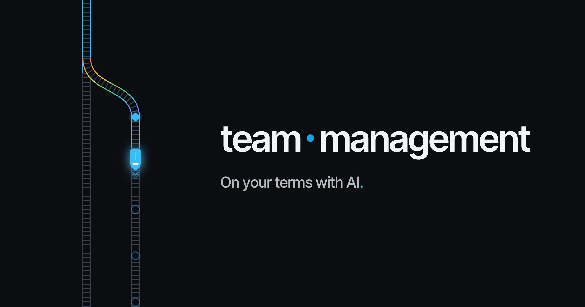

<p align="center">
  
</p>

<h1 align="center">team.management</h1>

<hr>

<p align="center"><em>On your terms with AI.</em></p>

<p align="center">
  An open-source Claude Code plugin that puts every process on rails — the steps are
  enforced by hooks in the runtime as the work happens, so your AI can't fake the work.
</p>

<p align="center">
  <a href="#install"></a>
  <a href="LICENSE"></a>
  <a href="https://team.management"></a>
  <a href="https://github.com/TeamManagementPlugin/claude-plugin/stargazers"></a>
</p>

<br>

A more capable model does not become more trustworthy. It becomes more convincing — better at sounding done. team.management is the harness that keeps you in control: it shows the work, holds the process, and leaves a record you can check.

- **See it.** Watch each step as it runs — which stage it's on, what's allowed, what's finished. No black box.
- **Enforce it.** Discussion comes before code. In discussion mode the hooks block edits until you've agreed on a plan, and a workflow protocol drives the steps from the runtime — not from the prompt.
- **Prove it.** Every run leaves a record of what happened — the protocol, the steps, the gates — written to plain files in your project. It's local, and it's yours to keep. (The record is honest about what checked what: review gates are AI judgment; the test gate is deterministic.)

## What it is

team.management is a native Claude Code plugin. It enforces the **DAIC** loop — **Discussion, Alignment, Implementation, Check** — through Python hooks and a protocol engine. When Claude tries to edit code before you've agreed on an approach, the hooks block the tools and ask for discussion first. That one rule prevents the most common failure of AI coding: confident over-implementation before anyone aligned on the plan.

## Install

team.management installs through Claude Code's plugin marketplace — there is no pip or npm package.

```
/plugin marketplace add TeamManagementPlugin/claude-plugin
```

```
/plugin install team-management@team-management
```

Then enable it for the project and restart Claude Code:

```
/team-management:init
```

On **Windows**, `/team-management:init` is required, not optional — it provisions the `python3` command the hooks need (skip it and the hooks fail to load with `python3: command not found`). See **[docs/INSTALL.md](docs/INSTALL.md)** for prerequisites, Windows setup, team enablement, and uninstall.

## How it works

1. **Describe what you want**, in plain language. Claude doesn't start coding — it recommends a workflow protocol, explains why it fits, and waits for your go-ahead.
2. **Approve the protocol.** From there it drives the lifecycle and sets the right mode at each step:
   - **Investigation** — read-only. Claude explores the code and proposes a plan with measurable success criteria.
   - **Implementation** — once you approve the plan, editing unblocks and Claude writes the code and tests.
   - **Code review** — spec-compliance and quality review (plus any AI providers you enable) before it can advance.
   - **Documentation** — docs and work-log updates.
   - **Completion** — you test the change and confirm; the protocol wraps up the git and issue work.
3. **You stay in control.** You approve the plan before implementation, and Claude advances a step only once you're satisfied — nothing runs ahead.

Other protocols cover the rest of the work — `research`, `brainstorm`, `refactoring`, and metric-driven `optimize`. Claude picks the fit and explains why before starting.

## Features

- **DAIC enforcement** — discussion-before-implementation, enforced by hooks in the runtime.
- **Persistent tasks** — task context in version-controlled markdown, loaded automatically across sessions.
- **Branch enforcement** — keeps a task's work on its own git branch.
- **Issue tracking** — bidirectional sync with GitLab, Jira, and GitHub / Gitea.
- **MCP server** — exposes the workflow as first-class Claude Code tools, so the agent reliably discovers them.
- **AI providers** — bring in Codex or Antigravity for a second opinion during investigation, implementation, and code review.
- **LLM wiki** — an optional, compounding knowledge base Claude maintains as you work.

## Documentation

- **[Install & setup](docs/INSTALL.md)** — prerequisites, Windows, team enablement, uninstall
- **[Usage guide](docs/USAGE_GUIDE.md)** — protocols, features, and configuration
- **[MCP server](docs/MCP_SERVER.md)** — architecture and tool reference
- **[team.management](https://team.management)** — the website, [docs](https://team.management/docs), and [protocols](https://team.management/protocols)

## Requirements

- **Claude Code** — loads the plugin's hooks and MCP server
- **Python 3.10+** — the plugin builds its own isolated venv on first run
- **Git** — recommended, for branch enforcement

## License

MIT — see [LICENSE](LICENSE).

## Credits

team.management stands on work that shaped its design:

- **[cc-sessions](https://github.com/GWUDCAP/cc-sessions)** by GWUDCAP — origin of the DAIC methodology and the sessions/hook-enforcement model.
- **[superpowers](https://github.com/obra/superpowers)** by Jesse Vincent (obra) — a composable-skills approach for coding agents.
- **[get-shit-done](https://github.com/open-gsd/gsd-core)** by open-gsd — meta-prompting and spec-driven development for AI agents.
- **[LLM Wiki](https://gist.github.com/karpathy/442a6bf555914893e9891c11519de94f)** by Andrej Karpathy — the compounding AI-maintained knowledge base behind the wiki feature.
- **[autoresearch](https://github.com/karpathy/autoresearch)** by Andrej Karpathy — the metric-driven experimentation behind the optimize protocols.

---

<p align="center">
  Conceived &amp; directed by <strong>Alex Rozanski</strong> · Crafted &amp; implemented by <strong>Max Tushkov</strong>
</p>

<p align="center"><em>An independent project — not affiliated with or endorsed by any AI provider. All product names and logos are the property of their respective owners.</em></p>
